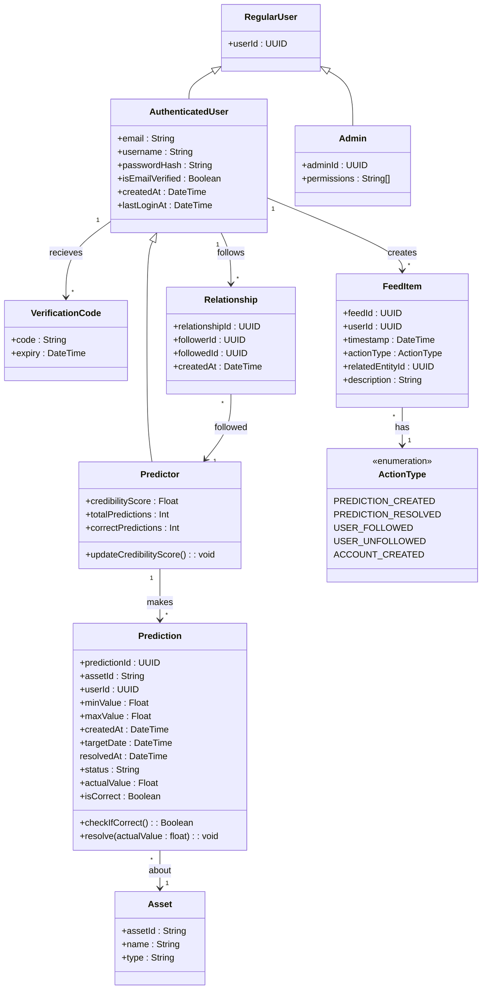

# Domain Model

This document describes the domain model of Guess Street. It shows the classes in the system along with their attributes and their relationships, made with Mermaid syntax.

## Class Diagram

## Class Descriptions

### RegularUser
Represents the default user in the system with only the essential user ID. Serves as the parent class for all user types.

### AuthenticatedUser
Represents a user who has completed the authentication process and can log into the system. Contains credentials, email verification status, and timestamps for creation and last login.

### Predictor
A specialized authenticated user who has made at least one prediction. Tracks performance metrics including credibility score, total predictions made, and accuracy statistics to build reputation on the platform over time.

### Admin
System administrator with permissions to manage the platform. Can perform system-level operations beyond regular user capabilities. 

### VerificationCode
Temporary codes used for email verification and password reset processes. Each code has an expiration time.

### Prediction
Rrepresents a user's prediciton for a specific asset. Contains the prediction range, target date, resolution status, and actual outcome when the prediction period ends.

### Asset
Represents tradeable financial assets (stocks, crypto, commodities) that users can make predictions about. Uses Yahoo Finance ticker symbols.

### Relationship
Represents the social following connections between users. Tracks who follows whom and when the relationship was made.

### FeedItem
Entries in a user's feed showing actions performed by the user, or people they follow. Contains metadata about the action type and references to the related entities that triggered the feed entry.

### ActionType
Enumeration defining the different types of activities that can generate feed items. Includes prediction creation/resolution, user following/unfollowing, and account creation.

