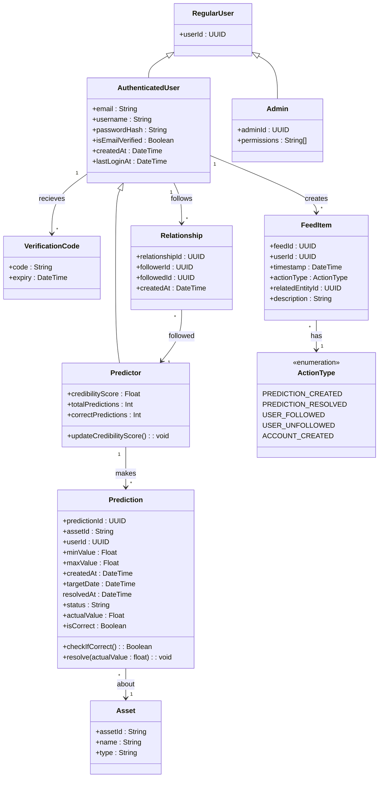

# Domain Model

This document describes the domain model of Guess Street. It shows the classes in the system along with their attributes and their relationships, made with Mermaid syntax.

## Class Diagram

